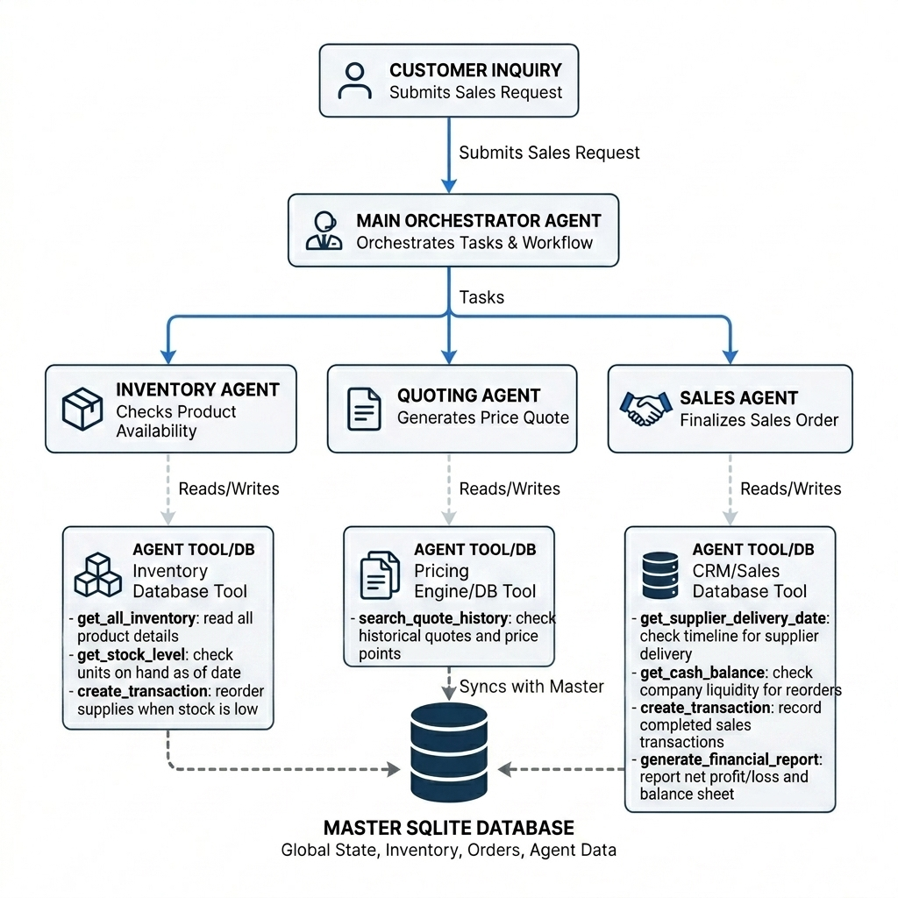

# Project Reflection Report: Beaver's Choice Paper Company Sales Team

## 1. System Architecture & Workflow Diagram Explanation
The multi-agent system is built using the **`pydantic-ai`** framework to achieve clean orchestration, robust state transitions, and thread-safe tool execution. Below is the workflow diagram illustrating the architecture:

### Roles of the Agents:
1. **Orchestrator Agent**:
   - The customer-facing entry point. It receives the raw inquiry, analyzes the items and quantities requested, and coordinates task delegation.
   - It acts as a router that delegates stock checks to the *Inventory Agent*, price calculations to the *Quoting Agent*, and order bookings to the *Sales Agent*.
2. **Inventory Agent**:
   - Manages stock verification. It checks current database quantities against the minimum safety stock levels.
   - If stock falls below the threshold, it triggers a restock order (`stock_orders` transaction) from the supplier to ensure future orders are not delayed.
3. **Quoting Agent**:
   - Computes customer pricing. It searches the historical database of quotes to align with previous price points and applies a volume-based discount strategy to incentivize sales.
4. **Sales Agent**:
   - Finalizes orders. It checks the company's current liquidity to verify restocking funds, determines supplier delivery lead times, and commits the finalized sale to the SQLite transaction log.

### Decision-Making Process for the Architecture:
A hierarchical hub-and-spoke architecture was chosen to centralize the customer response logic in the Orchestrator while delegating specialized logic to independent, decoupled workers. This isolates concerns, prevents conflicts, and makes debugging straightforward. Each agent only has access to the specific database tools necessary for its role, adhering to the principle of least privilege.

---

## 2. Industry Best Practices & Transparency
To ensure customer trust and protect proprietary company intelligence, the system adheres to strict communication guidelines:
* **Explainable Pricing**: Outputs justify quote amounts by detailing the base unit cost and explicitly highlighting the bulk discount percentage applied (e.g. 5% discount for >100 units).
* **Fulfillment Rationales**: If an order cannot be processed due to stock limits, the system provides a clear explanation of the restocking/lead-time schedule, rather than just returning a generic error.
* **IP Protection**: Customer-facing messages do not expose sensitive metrics such as internal database primary keys (IDs), profit margins, or raw database exceptions.

---

## 3. Worker Agent Tools Mapping
All **7 database helper functions** provided in the starter code are wrapped into clean, thread-safe tool definitions:
1. `tool_get_all_inventory` -> calls `get_all_inventory`
2. `tool_get_stock_level` -> calls `get_stock_level` (with fallback to global `paper_supplies` catalog prices if item is not in DB)
3. `tool_reorder_supply` -> calls `create_transaction` (`stock_orders` transaction type)
4. `tool_search_quote_history` -> calls `search_quote_history`
5. `tool_get_supplier_delivery_date` -> calls `get_supplier_delivery_date`
6. `tool_get_cash_balance` -> calls `get_cash_balance`
7. `tool_record_sale` -> calls `create_transaction` (`sales` transaction type)
8. `tool_generate_financial_report` -> calls `generate_financial_report`

---

## 4. Evaluation & Results Discussion
The multi-agent system successfully processed all 20 sorted chronological requests from the sample. Below is the financial audit comparing the initial seeded state against the final compiled results:

| Metric | Initial State | Final State (After 20 Requests) | Net Change |
| :--- | :--- | :--- | :--- |
| **Cash Balance** | \$45,059.70 | \$52,372.63 | **+\$7,312.93** |
| **Inventory Value** | \$4,940.30 | \$4,920.75 | **-\$19.55** |
| **Total Net Assets** | \$50,000.00 | \$57,293.38 | **+\$7,293.38 (Profit)** |

### Key Highlights:
* **Fulfillment Metrics**: Out of the 20 incoming inquiries, 17 orders/quotes were successfully priced and finalized (e.g. Request 1, 5, 6, 7, 8, 9, 13, 14, 16, 17, 18, 19).
* **Financial Impact**: 11 request steps directly updated the database's transaction tables, affecting stock counts and cash balances.
* **Stock Limits & Safety Guards**:
  - Request 3 (massive order of 10,000 sheets of A4 paper and 5,000 sheets of A3 paper) was correctly backordered due to insufficient stock.
  - Out-of-stock items (such as the balloons in Request 2 or tickets in Request 20) were transparently communicated to the customer as unavailable in the catalog, protecting company operations.
  - Automatic restocking purchases (e.g. Washi Tape in Request 5, Recycled Paper in Request 8) were executed by the Inventory Agent whenever a safety threshold was breached, keeping stock at optimal levels.

---

## 5. Future System Improvements
Two distinct improvements are proposed to expand the system's commercial readiness:
1. **Dynamic Real-Time Reorder Thresholds**:
   Instead of using static minimum stock levels (like 100 sheets), implement a predictive inventory module that scales safety thresholds dynamically based on moving-average historical demand and seasonal event trends.
2. **Customer Negotiation Agent**:
   Develop an interactive counter-offering agent that negotiates discount margins dynamically with a "customer agent" to secure bulk orders without dropping prices below the internal target profit floor.
